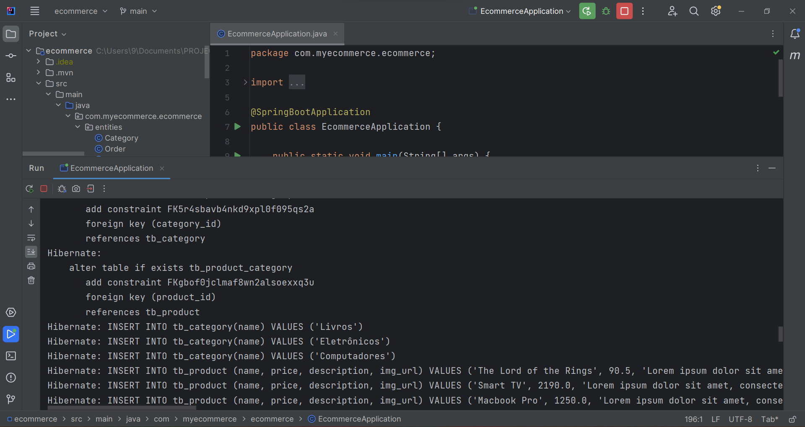
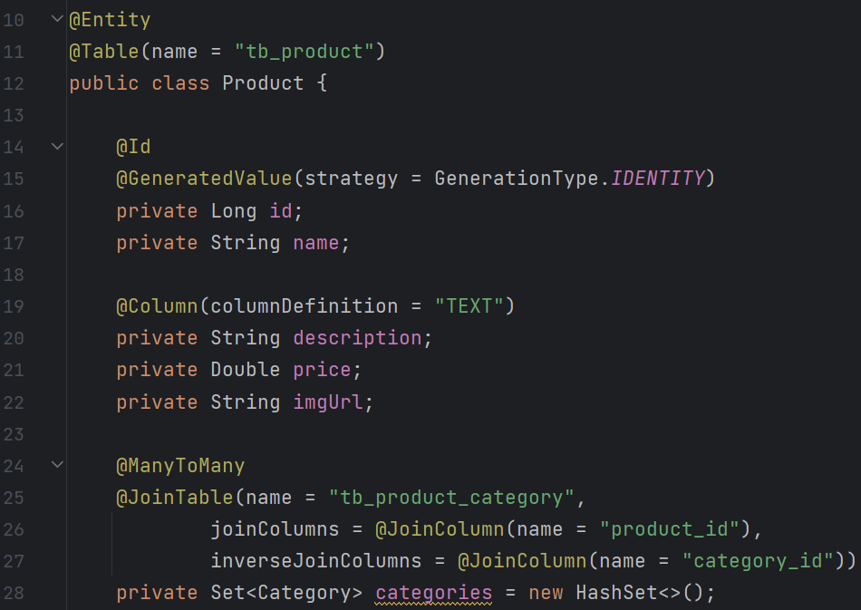
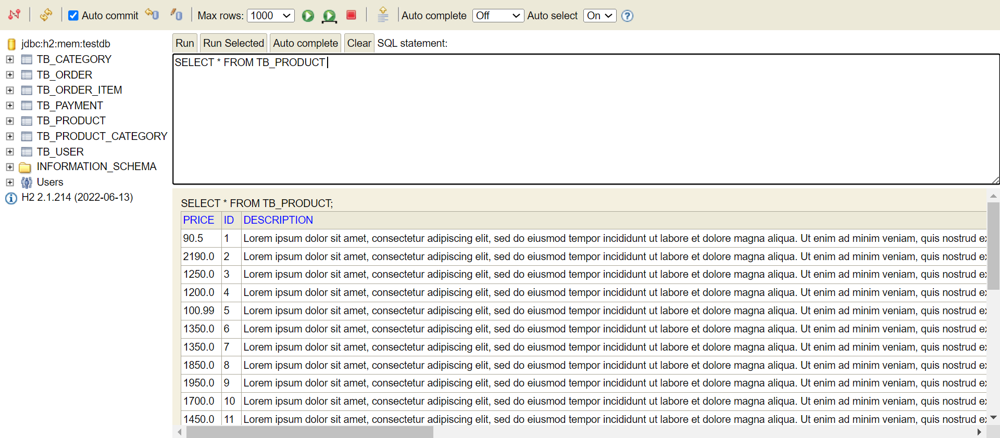

# E-Commerce System!

## An E-commerce System using Spring Data JPA!

In this project we are going to implement the following domain model using an ORM(Object Relational Mapping) tool:

&nbsp;  
This domain model is implemented in Spring using Spring Data JPA that simplifies database access and management in Spring applications, reducing the amount of boilerplate code, providing a consistent and convenient way to interact with databases, and supporting multiple databases. In this case we use the H2 database.
&nbsp; 
&nbsp;  

|               SCREENSHOTS             
:------------------------------------------------:
 

&nbsp; 
&nbsp; 

Use ORM, or Object-Relational Mapping, simplifies the experience of interacting with a database by bridging the gap between the object-oriented programming world and the relational database world. It does so through the following key mechanisms:

- Abstraction of Database Operations
- 
- Mapping between Objects and Tables
- 
- Automatic SQL Generation

&nbsp;

&nbsp;

&nbsp;

As you can see, the data was correctly generated in the database and the Domain Model was successfully implemented.
